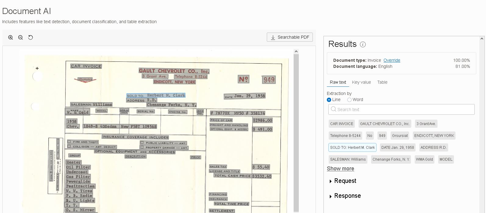

# Real life Funtions (Fn) use cases

## Purpose
Collection of useful FN samples that can be applied to real life scenarios.

## List of Projects 
1. [Auto OCR Files](#auto-ocr-files)
2. [Auto Blur Images](#auto-blur-images)

## Common Prerequsites
1. Create Free Oracle Cloud account, start [here](https://www.oracle.com/cloud/free/ "Oracle Free Tier"). It is totaly free, takes less than two minutes. Credit card information is required to verify your identity, no charges will be incurred. You will get free
   * 2 Oracle Autonomous Databases
   * 2 Virtual Machines 
   * First 2 million Function invocation
   * First 400K Gb memory * seconds 
for free for life as long as you use them.
2. Setup OCI CLI as described [here](https://github.com/oracle/oci-cli)
3. Setup your functions development environment by choosing one of the options listed [here](https://docs.oracle.com/en-us/iaas/Content/Functions/Tasks/functionsquickstartguidestop.htm). 

## Compute Maintenance with Functions

## Auto OCR Files

Suppose that we want to automate extracting text from images and non-convertible PDF files when files are uploaded to object storage. Since the files might be bigger than online processing limits of services it creates an asynchronous jobs. After the jobs are completed extracted text is stored in database, as well as searchable PDF document and json outputs are stored under another bucket for later usage. 

Main OCI components utilized
- [Object Storage](https://docs.oracle.com/en-us/iaas/Content/Object/home.htm): Storing files and extracts
- [Events](https://docs.oracle.com/en-us/iaas/Content/Events/home.htm): Object storage object creation emits events to invoke functions
- [Functions](https://docs.oracle.com/en-us/iaas/Content/Functions/home.htm): Triggered by events, processing documents
- [AI Vision](https://docs.oracle.com/en-us/iaas/vision/vision/using/home.htm): Extracting text with OCR and searchable pdf generation
- [Autonomous Database](https://docs.oracle.com/en-us/iaas/autonomous-database-shared/index.html): Providing data layer over [ORDS](https://www.oracle.com/database/technologies/appdev/rest.html) for storing extracted text with minimum effort
- [Logging](https://docs.oracle.com/en-us/iaas/Content/Logging/home.htm): Logging and debugging event rules and functions

We will provide the functionality in two steps.
1. Object storage will emit an event when an image or pdf file is uploaded. That event will trigger our first function which will submit an ai vision document job to process files asynchronously. 

Click :point_right: [Part:1 - Submit a Vision document job when a document is uploaded to object storage bucket](./oss-obj-cre-doc-job-py/README.md) for complete steps.

2. Vision service will process files and create output in a temporary bucket. Temporary bucket will emit an event which will trigger our second function. This function will read json output (extracted text) and update a database over ORDS, then move searchable pdf file to final location.

Click :point_right: [Part:2 - Process output of Vision document job and organize new information](./oss-obj-pro-doc-job-res-py/README.md) for complete steps.

[^ back](#purpose)

## Auto Blur Images

We want to blur faces and number plates when images are uploaded to an object storage bucket. For this purpose bucket will emit an event which will trigger a function and the function will blur the faces and number plates using [OpenCv](https://opencv.org/) library. In order to use a third party library function uses a custom Dockerfile. 

Click :point_right: [Auto Blur Images](./oss-obj-cre-img-blur-py/Readme.md) for complete steps.

[^ back](#purpose)

