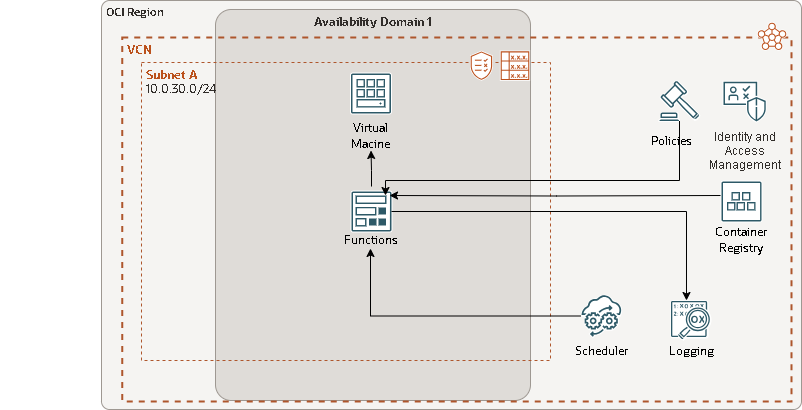
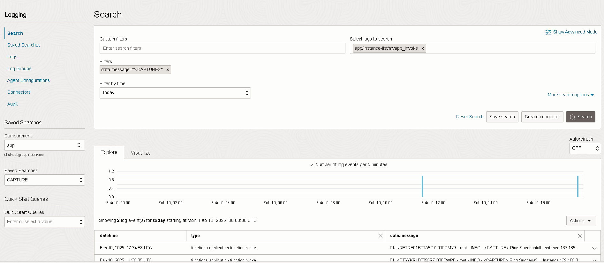
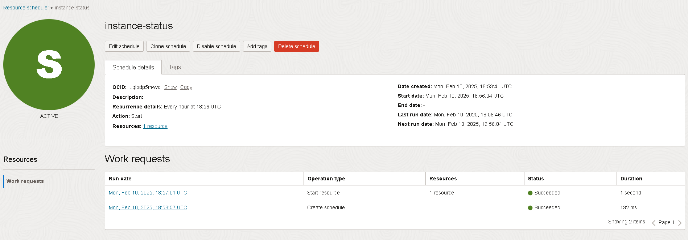

# Restart Compute Instance with Functions

Schedule a function to check if the compute instance is reachable and restart it if necessary. Store the function logs in OCI Logging Service. 

## Steps

### 1. Create Dynamic Group
Create a dynamic group to identify the functions we want to authorize to manage the instances.

Sample Dynamic Group for only one function in the compartment:
```plaintext
ALL {resource.compartment.id = '<compartment-ocid>', resource.id = '<function-ocid>' }
```

Sample Dynamic Group for all functions in the compartment:
```plaintext
ALL {resource.type = 'fnfunc', resource.compartment.id = '<compartment-ocid>'}
```

### 2. Root Level Policy
Create a root level policy to allow the dynamic group to manage the instances

Sample Policy to manage all instances in the tenancy:
```plaintext
Allow dynamic-group <dynamic-group-name> to manage instances in tenancy
```

Sample Policy to manage all instances in the compartment:
```plaintext
Allow dynamic-group <dynamic-group-name> to manage instances in compartment <compartment-name>
```

PS: If you have more than one IAM domains use the following syntax:
```plaintext
Allow dynamic-group <domain-name>/<dynamic-group-name> to manage instances in [ tenancy | compartment <compartment-name>]
```

### 3. Create FN Context
Create a new FN context in your development environment. It can be your local machine, cloud shell or compute instance on OCI. [FN Project Tutorial](https://fnproject.io/tutorials/python/intro/) is a good starting point. Also see OCI documentation for [OCI Functions](https://docs.oracle.com/en-us/iaas/Content/Functions/Concepts/functionsoverview.htm).

```bash
fn create context chalhoubgroup --provider oracle
```

### 4. Use The Context
Use the context to switch between different contexts. 

```bash
fn use context chalhoubgroup
```

### 5. Update Compartment
Update the compartment to the one you want to deploy the function. 

```bash 
fn update context <compartment-ocid>
```

### 6. Set Container Registry 
Set the container registry where the container images will be pushed. At this point I recommend creating the registry in the compartment where the function will be deployed. By default the registry is created in the root compartment if ot doesn't exist. 

```bash
fn update context registry dxb.ocir.io/<object-storage-namespace>/fn-repo
```

### 7. Set Functions Endpoint 
Set the functions endpoint to invoke the functions. 

```bash
fn update context api-url https://functions.me-dubai-1.oci.oraclecloud.com
```

### 8. List Context 
List the contexts to see the current context and others.
```bash
fn list context

ubuntu@FAKELES-7310:~/fn-projects$ fn list context
CURRENT NAME            PROVIDER        API URL                                                 REGISTRY
*       chalhoubgroup   oracle          https://functions.me-dubai-1.oci.oraclecloud.com        dxb.ocir.io/<object-storage-namespace>/fn-repo
        default         default         http://localhost:8080
        fn-ctx-london   oracle          https://functions.uk-london-1.oci.oraclecloud.com       lhr.ocir.io/<object-storage-namespace>/fn-repo
        me-dubai-1      oracle          https://functions.me-dubai-1.oci.oraclecloud.com        dxb.ocir.io/<object-storage-namespace>/fn-repo
```

### 9. Create A New Application From OCI Console 

### 10. List Applications
List the applications to see what is already available. 

```bash
fn list apps

ubuntu@FAKELES-7310:~/fn-projects$ fn list apps
NAME                    ID
MyOCIApplication        ocid1.fnapp.oc1.me-dubai-1.<app-ocid>
OCI-status-app          ocid1.fnapp.oc1.me-dubai-1.<app-ocid>
myapp                   ocid1.fnapp.oc1.me-dubai-1.<app-ocid>
```

### 11. Docker Login
Login to the container registry to push the container images. 

```bash
docker login -u '<object-storage-namespace>/<user-name>' dxb.ocir.io -p '<auth-token>'
```

Check OCI Documentation for [Docker Login](https://docs.oracle.com/en-us/iaas/Content/Registry/Tasks/registrypushingimagesusingthedockercli.htm) and see my previous [blog post](https://oci-daily.blogspot.com/2024/12/back-to-basics-pushing-container-images.html) for more information.


### 12. Create a New Function and Deploy
Create a new function using the following command. It will create boilerplate code with three files: `func.yaml`, `func.py` and `requirements.txt`. 

```bash
fn init --runtime python hello-python
cd  hello-python
fn -v deploy --app myapp
```

### 13. Test The Function
```bash
echo '{"name":"George"}' | fn invoke myapp hello-python

ubuntu@FAKELES-7310:~/fn-projects$ echo '{"name":"George"}' | fn invoke myapp hello-python
{"message": "Hello George"}
```

### 14. Create a New Function
```bash
fn init --runtime python oci-compute-control-python
cd oci-compute-control-python
fn -v deploy --app myapp
```

### 15. Enable Debug
Enable debug to see the logs. 
```bash
fn config function myapp oci-compute-control-python log-level "DEBUG"
```

### 16. Test The Function
Test the function by paasing the instance ocid and ip as parameters
```bash
echo '{"instance-ocid":"<instance-ocid>", "instance-ip":"139.185.35.245"}' | fn invoke myapp oci-compute-control-python

ubuntu@FAKELES-7310:~/fn-projects$ echo '{"instance-ocid":"<instance-ocid>", "instance-ip":"139.185.35.245"}' | fn invoke myapp oci-compute-control-python
{"status": "Success", "message": "Ping Successfull, Instance is reachable"}
```

### 17. Observing The Function

I just enabled the logs and viewed function logs in [Logging Service](https://docs.oracle.com/en-us/iaas/Content/Functions/Tasks/functionsobservingfunctions.htm). 

### 18. Set Instance ocid and Ip as Configuration Parameters
In my use case I needed to check only one instance, so I set the instance ocid and ip as configuration parameters. This was also required for automating the process by [Scheduling Functions](https://docs.oracle.com/en-us/iaas/Content/Functions/Tasks/functionsschedulingfunctions-about.htm)
```bash
fn config function myapp oci-compute-control-python instance-ocid "<instance-ocid>"
fn config function myapp oci-compute-control-python instance-ip "139.185.35.245"
```

### 19. Test The Function
Test the function by invoking it without passing the parameters. 
```bash
fn invoke myapp oci-compute-control-python

ubuntu@FAKELES-7310:~/fn-projects/oci-compute-control-python$ fn invoke myapp oci-compute-control-python
{"status": "Success", "message": "Ping Successfull, Instance is reachable"}
```

### 20. Create Dynamic Group for Resource Scheduler
Create a dynamic group to identify the schedules. Here is some [examples]((https://docs.oracle.com/en-us/iaas/Content/resource-scheduler/references/example_policies.htm)). 
```plaintext
ALL {resource.type='resourceschedule', resource.id='<resource-schedule-ocid>'}

```

### 21. Create A Policy for Resource Scheduler Dynamic Group
Create a policy to allow the dynamic group to manage the resources. 
```plaintext
Allow dynamic-group <dynamic-group-name> to manage all-resources in [ tenancy | compartment <compartment-name>]
```

### 22. Schedule The Function

It's not uncommon to use functions for maintenance and housekeeping, data science, ai and ml, and data processing. I scheduled the function to run every 5 minutes using [Schedules](https://docs.oracle.com/en-us/iaas/Content/Functions/Tasks/functionsschedulingfunctions-about.htm)

## Troubleshooting

### 404: NotAuthorizedOrNotFound Error
If you get this error, it means the function doesn't have the required permissions to manage the instances. Check the dynamic group and policy.

### Resource Scheduler Error
If you get an error from the resource scheduler, it means the dynamic group doesn't have the required permissions to manage the resources. Check the dynamic group and policy. 

Also make sure the function is deployed and the configuration parameters are set. 