# 30 Minutes Workshop: Develop a Movie Application with APEX
*Control click the below screenshot to watch the entire demo video on* . *You will find videos which display only the related parts for each section below*
[](https://youtu.be/XRMmDQ28piw)

## Purpose
You will develop a web application with a dashboard, calendar and faceted search page in 30 minutes. 

The original demonstration belongs to my colleague [Shakeeb Rahman](https://www.linkedin.com/in/shakeebrahman/) and you can watch it on [YouTube](https://youtu.be/VlYa5xkF_kE "Low Code App Dev with Oracle APEX: Building a Simple Movie App") (which is really impressive) and 
find more on **Oracle Application Express** [YouTube Channel](https://www.youtube.com/channel/UCEpIXFjcQIztReQNLymvYrQ).

## Prerequsites
1. Create Free Oracle Cloud account, start [here](https://www.oracle.com/cloud/free/ "Oracle Free Tier"). It is totaly free, takes less than two minutes. Credit card information is required to verify your identity, no charges will be incurred. You will get
   * 2 Oracle Autonomous Databases
   * 2 Virtual Machines 
for free for life as long as you use them.

2. Download [this csv file](./resources/tmdb-movies_smaller.csv "CSV file") which I downloaded from [The Movie Database](www.themoviedb.org).

## Steps
1. [Create Autonoumous Database](#1-create-autonoumous-database-2-min)
2. [Create APEX Workspace](#2-create-apex-workspace-40-sec)
3. [Load CSV File](#3-load-csv-file-1-min) 
4. [Create Application](#4-create-application-1-min) 
5. [Run Application for the First Time](#5-run-application-for-the-first-time-1-min) 
6. [Calendar Page](#6-calendar-page-1-min)
7. [Dashboard](#7-dashboard-6-min)
	- [Chart Genres](#71-chart-genres-1-min)
	- [Chart Runtime](#72-chart-runtime-1-min)
	- [Chart ROI](#73-chart-roi-2-min)
	- [Chart Major Producers](#74-chart-major-producers-2-min)
8. [Report Page](#8-report-page-5-min)
9. [Faceted Search Page](#9-faceted-search-page-8-min)

##  1. Create Autonoumous Database (2 min)
Create your autonomous database in your cloud account. The interface is very intuitive. Follow screen instructions. If you need help press help button on the very same screen.

*Control click the below screenshot to see the video* .
[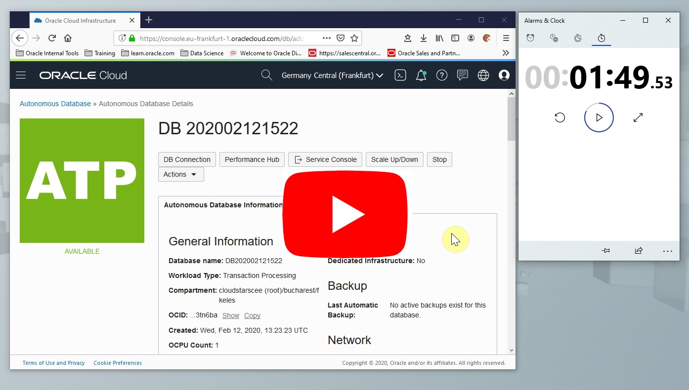](https://youtu.be/_cdAjzawbU0)

[^ back](#steps)

##  2. Create APEX Workspace (40 sec)
Login with **ADMIN** user and create an APEX workspace. By doing this you will also be creating a database schema. 

*Control click the below screenshot to see the video* .
[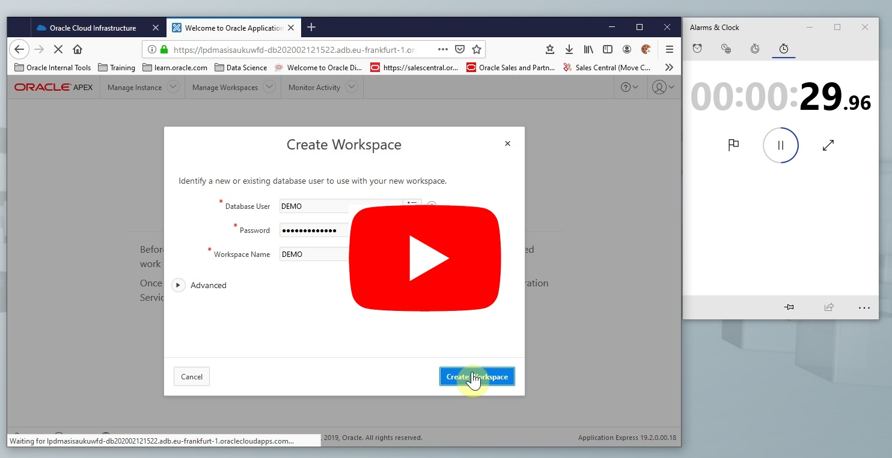](https://youtu.be/wgCU4hkMtvw)

[^ back](#steps)

##  3. Load CSV File (1 min)
Logout from *Administration Services* and login using *Workspace Sign-In*

Login with **DEMO** user and load [CSV file](./resources/tmdb-movies_smaller.csv "CSV file")

*Control click the below screenshot to see the video* .
[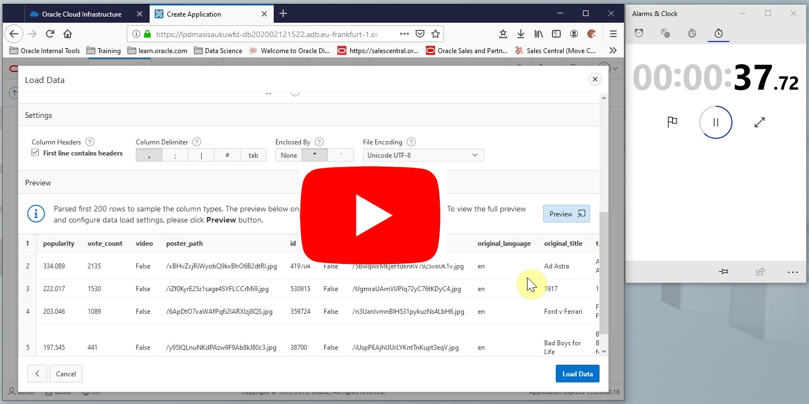](https://youtu.be/EwXDxuooNug)

[^ back](#steps)

##  4. Create Application (1 min)
After loading csv file data into **movies** table, create application. APEX analyzes data and suggests you the best possible page options you may want to create. In this example we will have
 - Home Page (Blank)
 - Dashboard Page (With charts offered by APEX)
 - Movies Search (A faceted search page new in APEX 19.2)
 - Movies Report (A tabular report page which we will turn into fancy cards)
 
Most of the work will be done by automatically by APEX. We will interfere very little. 
 - First inspect **Dashboard** page by clicking **Edit** and see what charts are suggested by APEX by just looking at your data and learning about it. We are going to change suggested charts with the ones that display our information of interest. 
 - Then edit the **Faceted Search Page**, change page type from reports to cards. Set the following 
 ```
 Card Title: Title
 Description Column: Tagline
 Additional Text Column: Overview
 ```
 - Check **Movies Report** page
 - There is another page called **Calendar**
 - Click **Check All** Features
 - Create application 
 
*Control click the below screenshot to see the video* .
[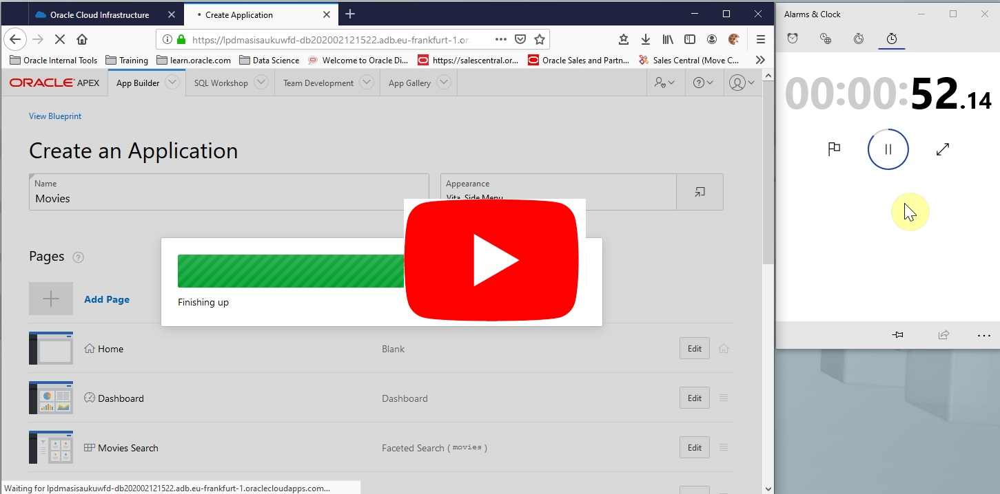](https://youtu.be/q2Fm9OvrQEs)

[^ back](#steps)
 
##  5. Run Application for the First Time (1 min)
Now lets run the application for the first time and see what APEX has done for us. 
 - Login to application with **DEMO** user
 - Navigate to **Dashboard** and inspect the charts suggested by APEX.
 - Navigate to **Movies Search** page and see the faceted search and card tiles.
 - See **Movies Report** page, which looks like a regualar tabular report page.
 - Inspect **Calendar** page see how the movies are placed on calendar according to release date.
 
*Control click the below screenshot to see the video* .
[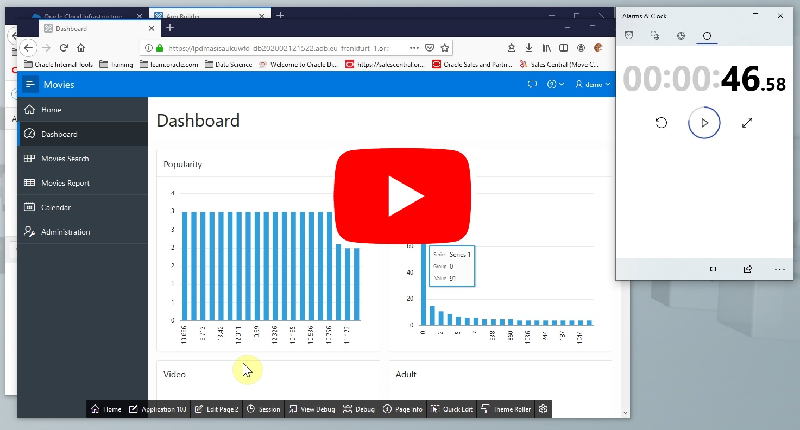](https://youtu.be/Smrt0Qtnadc)

[^ back](#steps)
 
##  6. Calendar Page (1 min)
Lets start with an easy fix, current calendar page doesn't display movie titles. 
 - Navigate to Calendar page
 - Click **Quick Edit** on the developer toolbar at the bottom of the page and then click anywhere on the calendar. This will take you to calendar page in the editor.
 - Hide empty positions on the layout menu, this will simplify the page layout.
 - Select Calendar > Attributes under Content Body on the left panel, then change settings on the right panel
``` 
Display Column: TITLE 
```
 - Save and run the page to see what changed

*Control click the below screenshot to see the video* .
[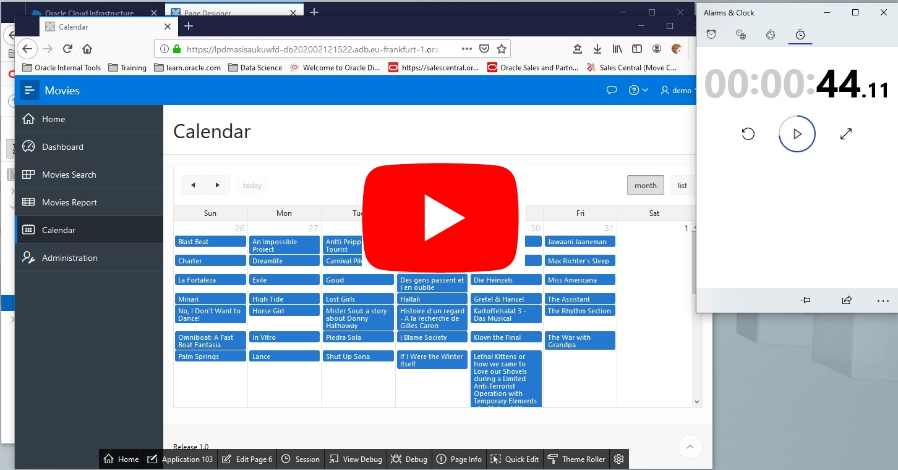](https://youtu.be/WpJa9wHkcF4)

[^ back](#steps)

##  7. Dashboard (6 min)
APEX suggested a good start for our dashboard, we will improve the page for finding answers to the following questions.
 1. What are the most popular genres?
 2. What is the average movie length?
 3. Which type of movies has a better return on investment?
 4. Who are the major producers, how are they compared?

Use the application builder and edit dashboard with page designer.

#### 7.1. Chart Genres (1 min)
We want to see which genre is most popular by comparing number of movies with a nice pie chart. 
  - Use this sql for series data source
```sql
SELECT genre, count(*) value
  FROM movies
 GROUP BY genre
 ORDER BY 2 DESC
```
 - Make these changes on the first chart
```
Region.Title: Genres
Region.Attributes.Chart Type: Pie
Region.Series.[0].Column Mapping.Label: GENRE
Region.Series.[0].Column Mapping.Value: VALUE
Region.Series.[0].Label.Show: Yes
Region.Series.[0].Label.Display As: Label
```

*Control click the below screenshot to see the video* .
[](https://youtu.be/WpJa9wHkcF4)

[^ back](#steps)

#### 7.2. Chart Runtime (1 min)
We want to show all records at once and runtime is a good candidate for this. We will see a bell shaped normal distribution that should be noticed.
 - Use this sql for series data source
```sql
SELECT runtime, count(*) value
  FROM movies
 GROUP BY runtime
 ORDER BY 1 ASC
```
 - Make these changes on the second chart
```
Region.Title: Runtime
Region.Attributes.Chart.Type: Bar
Region.Series.[0].Column Mapping.Label: RUNTIME
Region.Series.[0].Column Mapping.Value: VALUE
Region.Series.[0].Performance.Maximum Rows to Process: Null
Region.Axes.x.Title: Minutes
```

*Control click the below screenshot to see the video* .
[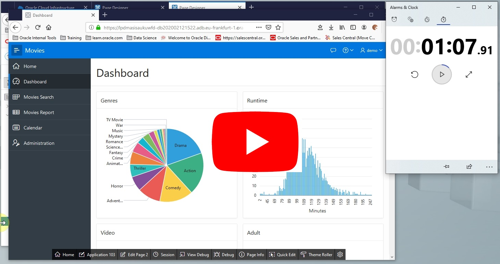](https://youtu.be/rRWLwI6fLl8)

[^ back](#steps)

#### 7.3. Chart ROI (2 min)
This chart is going to be a little complicated. We want to see how much is spend on each genre and how it is paying off. We will use 3 series, **Budget** and **Revenue** share the same y-axis whereas **ROI** uses the y2-axis as it is more like a percent
 - Make these changes on the third chart
```
Region.Title: Return
Region.Attributes.Chart.Type: Combination
Region.Attributes.Tooltip.Show Group Name: False
```
 - Use the following sql for each series (Alternatively you can also copy and paste the series then change it).
```sql 
SELECT genre, AVG(budget) avg_budget, AVG(revenue) avg_revenue, TRUNC(SUM(revenue)/SUM(budget)*100, 2) avg_return
  FROM movies
 WHERE NVL(budget,0) > 0 
 GROUP BY genre
 ORDER BY 4 ASC
```
 - Add Budget and Revenue Series 
```
Region.Series.[Budget|Revenue].Identification.Name: Budget|Revenue
Region.Series.[Budget|Revenue].Identification.Type: Bar 
Region.Series.[Budget|Revenue].Column Mapping.Label: GENRE
Region.Series.[Budget|Revenue].Column Mapping.Label: AVG_BUDGET|AVG_REVENUE
```
 - Add ROI Series and set **Assigned To Y2 Axis** to true
```
Region.Series.[ROI].Identification.Name: ROI
Region.Series.[ROI].Identification.Type: Line 
Region.Series.[ROI].Column Mapping.Label: GENRE
Region.Series.[ROI].Column Mapping.Label: AVG_RETURN
Region.Series.[ROI].Appearance.Assigned To Y2 Axis: True
```
 
*Control click the below screenshot to see the video* .
[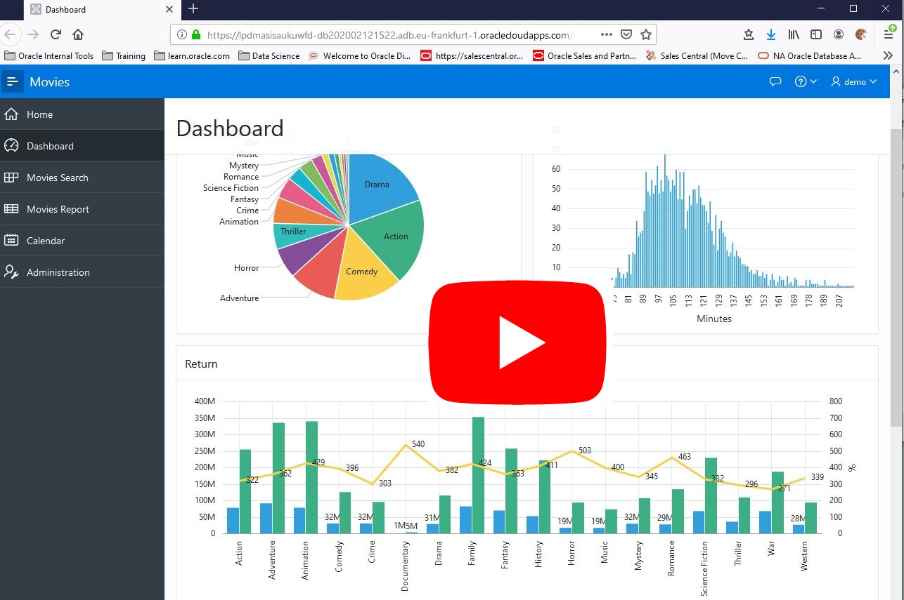](https://youtu.be/qdY-XIH6y04)

[^ back](#steps)

#### 7.4. Chart Major Producers (2 min)
In this chart we are going to display 4 different information and relationhips, so we are using a bubble chart.
 - Use this query for series data source
```sql
SELECT production_company, SUM(budget) budget, SUM(revenue) revenue, COUNT(*) ctr
  FROM MOVIES
 GROUP BY production_company
 ORDER BY 2 DESC
```
 - Use the following settings
```
Region.Title: Producers
Region.Attributes.Chart.Type: Bubble
Region.Attributes.Tooltip.Show Group Name: No
Region.Series.[0].Column Mapping.Series Name: Production_Company
Region.Series.[0].Column Mapping.Label: Production_Company
Region.Series.[0].Column Mapping.X: CTR
Region.Series.[0].Column Mapping.Y: SUM(Budget)
Region.Series.[0].Column Mapping.z: SUM(Revenue)
Region.Series.[0].Performance.Maximum Rows to Process: 30
Region.Axes.x.Title: #Movies
Region.Axes.y.Title: Budget
```

*Control click the below screenshot to see the video* .
[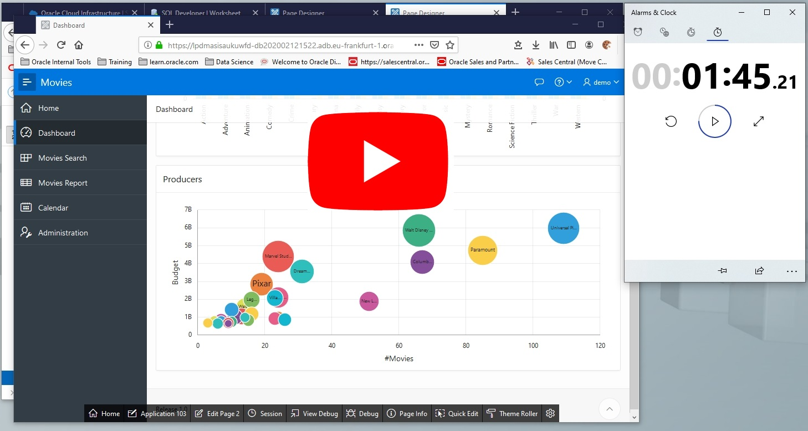](https://youtu.be/_lEY1nDCRq8)

[^ back](#steps)

## 8. Report Page (5 min)
This is pretty much looks like a tabular report page. Whereas there is more provided by APEX behind it. 
 - First simplfy the report by selecting the display columns and **Save** it.
```
Display in Report
	Title
	Genre
	Release Date
	Production Company
	Popularity
	Vote Average
	Budget
	Revenue
```
 - **Search Text** like "lord of the rings" or "amadeus" or "lucasfilm"
 - Let's experiment with **Group By** functionality
```sql
Avg(Budget), Avg(Revenue), Avg(Vote Average), Count(*) Group by Genre
```
 - Try to find which genre has most revenue and liked by people 
```
Order by Revenue desc, Vote Average desc
```
 - Now change group by from *Genre* to *Production Company* and averages to sum function so that we can see biggest production companies. 
 - Let's create the genre chart here, but this time we can **Filter**
```
Count(*) Group by Genre
```
 - Explore **Download** menu
 - Explore **Subscribe** menu

*Control click the below screenshot to see the video* .
[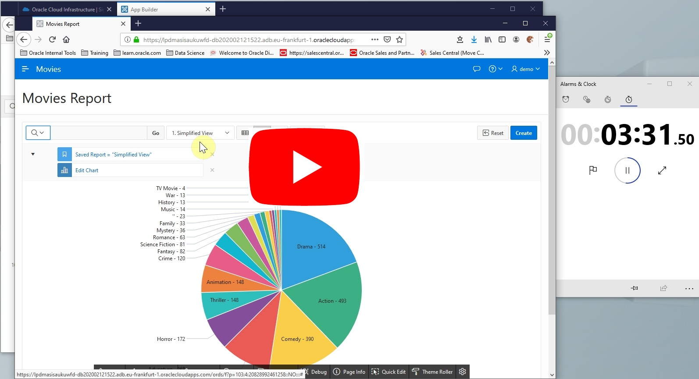](https://youtu.be/AHfihurkGKQ)

[^ back](#steps)

## 9. Faceted Search Page (8 min)
We modified faceted search page to display cards. This page will be most appealing page when we are done. 
 -  *POSTER_PATH* column to page source query. Follow *Content Body.Movies.Source.SQL Query* path on page components. You will be able to see new column. Also check if you already have *TITLE*
 - Edit *CARD_TEXT* to display the movie poster.
```
Content Body.Movies.Columns.CARD_TEXT.Column Formatting.HTML Expression: 

```
 - Follow *Content Body.Movies.Source.SQL Query* path on page components and replace *null CARD_LINK,* with the following piece of SQL query.
```sql
'https://www.imdb.com/title/'||IMDB_ID CARD_LINK,
```
 - Change the display features using "Quick Edit" feature at runtime.
```
Content Body.Movies.Attributes.Appearance.Template Options.Icons: No Icons
Content Body.Movies.Attributes.Appearance.Template Options.Layout: 5 Columns
```
 - In order to add a facet for Production Companies we need to add *PRODUCTION_COMPANY* column to page source query. Follow *Content Body.Movies.Source.SQL Query* path on page components.
 - Create a new facet as first item
```
Search.Facets.[0].Identification.Name: P8_PRODUCTION_COMPANY
Search.Facets.[0].Label.Label: Production Companies
Search.Facets.[0].List of Values.Type: Distinct Values
Search.Facets.[0].Source.Database Column: PRODUCTION_COMPANY
```

 - Create a new *Region* in *Breadcrumb Bar* position
```
Breadcrumb Bar.[0].Identification.Title: Search Bar Region
Breadcrumb Bar.[0].Appearance.Template: Blank with Attributes (No Grid)
```
 - Under newly created region create a new *Page Item*
```
Breadcrumb Bar.Search Bar Region.[].Name: P8_SEARCH_TEXT
Breadcrumb Bar.Search Bar Region.[].Appearance.Template: Hidden
Breadcrumb Bar.Search Bar Region.[].Appearance.Icon: fa-search
Breadcrumb Bar.Search Bar Region.[].Appearance.Value Placeholder: Search Movies...
Breadcrumb Bar.Search Bar Region.[].Appearance.Template Options.Stretch Form Item: True
Breadcrumb Bar.Search Bar Region.[].Appearance.Template Options.Size: X Large
```
 - Modify search facet to use the text field
```
Search.Facets.P8_SEARCH.Settings.Input Field: External Page Item
Search.Facets.P8_SEARCH.Settings.External Page Item: P8_SEARCH_PRODUCTION_COMPANY
```
 - Delete Breadcrumb page title
 
*Control click the below screenshot to see the video* .
[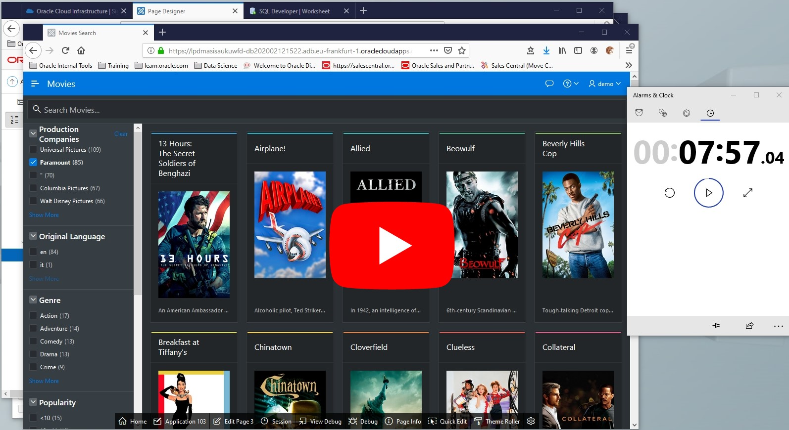](https://youtu.be/o2CBC0jro74)

[^ back](#steps)

## Getting Beyond This Workshop
1. Subscribe to Oracle Cloud with [Oracle Free Tier](https://www.oracle.com/cloud/free/ "Oracle Free Tier") offer and keep it!
2. Quick start APEX with [Oracle APEX](https://apex.oracle.com/en/learn/getting-started/ "Oracle APEX") website
3. Check Oracle Application Express [YouTube Channel](https://www.youtube.com/channel/UCEpIXFjcQIztReQNLymvYrQ)
4. Follow [Oracle APEX Blog](https://blogs.oracle.com/apex/) for news, tips and tricks
5. Don't forget to check out sample applications!
6. Use Oracle's [training material](http://apex.oracle.com/pls/apex/f?p=44785:2:0:FORCE_QUERY::2:P2_GROUP_ID,P2_PRODUCT_ID,P2_TAGS:1000,2039 "Learning Library") to learn
7. Practise, practise, practise to master your development skills!

[^ back](#steps)