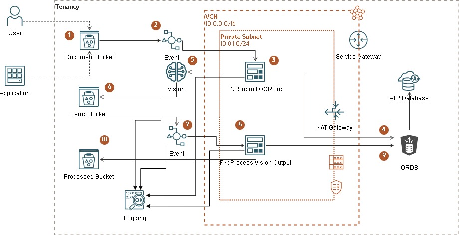
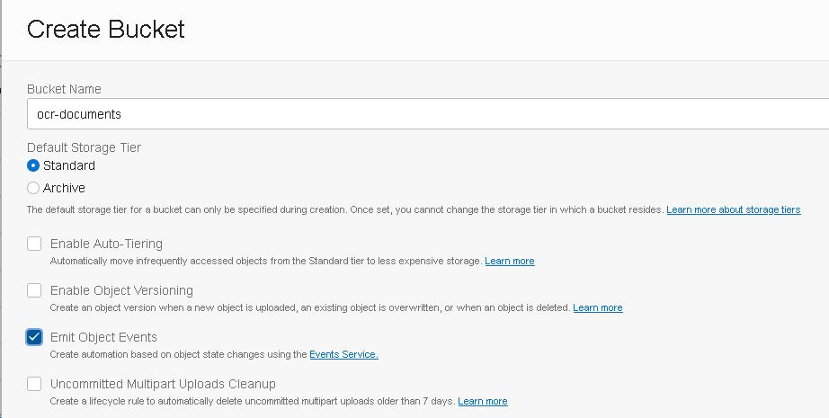
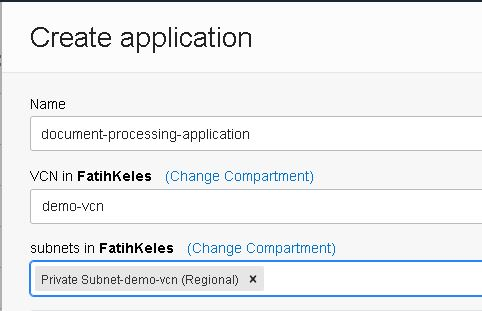
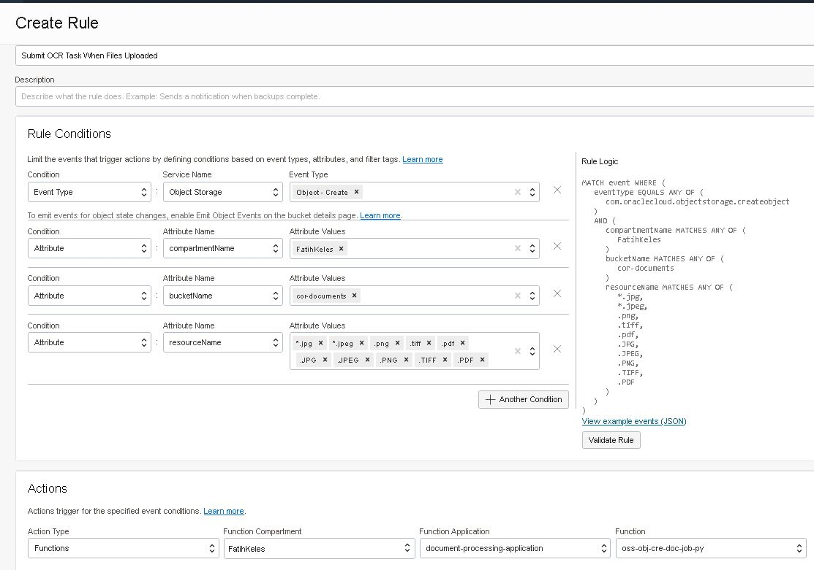
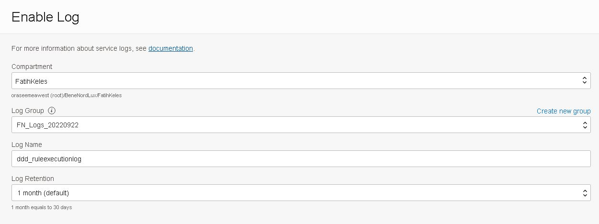
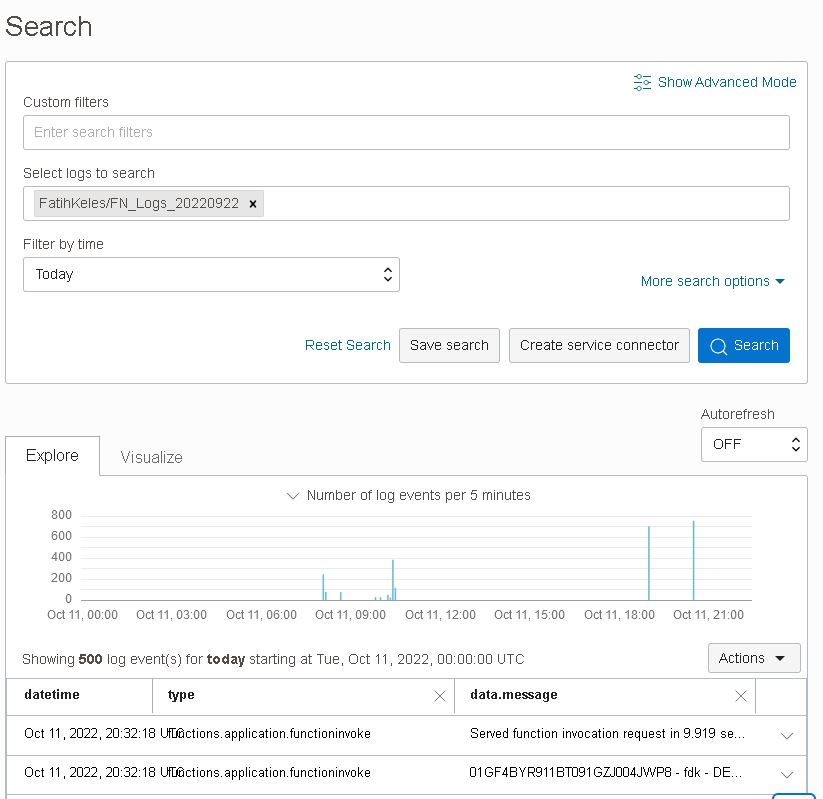
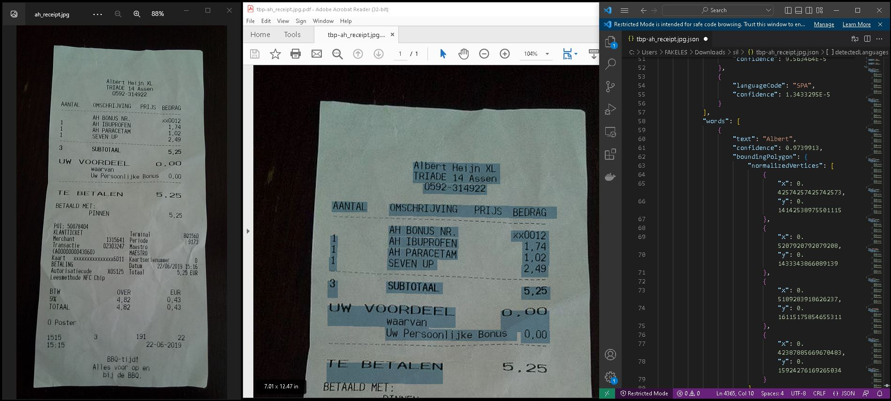

# Part:1 - Submit a Vision document job when a document is uploaded to object storage bucket

We have a bucket that stores our documents (image and pdf files). Once a new file is created, bucket will emit an event. If the event matches our event rule than a function will be triggered. This function will submit a vision document job which is going to do the actual work.

**`Steps 1-5`** will take place in part 1 of the implementation.

## Prerequsites
1. You will need one ORDS endpoint available. You can use [Autonomous Database](https://docs.oracle.com/en-us/iaas/autonomous-database-shared/doc/autonomous-quickstart.html), which comes with a managed ORDS feature or you can setup your own with any Oracle database edition. [Here](https://www.youtube.com/watch?v=ZNO4-6-scSE) is a quick demo recorded by a friend of mine on how to do it easily. 
2. Create a VCN using [wizard](https://docs.oracle.com/en-us/iaas/Content/Network/Tasks/quickstartnetworking.htm), we will deploy our function into a subnet. 

## Steps
1. [Create Buckets](#1-create-buckets)
2. [Create Application](#2-create-application)
3. [Create Function](#3-create-function)
4. [Create Event Rule](#4-create-event-rule)
5. [Enable Logs](#5-enable-logs)
6. [Create Table and Enable ORDS](#6-create-table-and-enable-ords)
7. [Run Demo](#7-run-demo)

##  1. Create Buckets
Create a bucket that holds documents and emits an event when a file is uploaded.

```bash 
oci os bucket create --compartment-id $compartment_id --name ocr-documents --object-events-enabled true
```

Create another bucket which will hold the output of Vision service and emit an event to trigger another function which is covered in [Part 2](../oss-obj-pro-doc-job-res-py/README.md).
```bash 
oci os bucket create --compartment-id $compartment_id --name ocr-documents-temp --object-events-enabled true
```

[^ back](#steps)

## 2. Create Application 
Create an application with a private subnet connectivity. 

```bash
oci fn application create --compartment-id $compartment_id --display-name document-processing-application --subnet-ids '["ocid1.subnet.oc1.uk-london-1.aaaaaaaarsfbhp6r6wmgvjrt24344q999999999999999999999999999999"]'
```

[^ back](#steps)

## 3. Create Function
Assuming that you have setup your functions development environment as described [here](https://docs.oracle.com/en-us/iaas/Content/Functions/Tasks/functionsquickstartguidestop.htm), now we create a function following the same [steps](https://docs.oracle.com/en-us/iaas/Content/Functions/Tasks/functionscreatingfirst.htm). 

- Create function with python runtime. This will create a folder named *oss-obj-cre-doc-job-py* which is also the name of the function
```bash
fn init --runtime python oss-obj-cre-doc-job-py
```
- Deploy function under recently created application
```bash
fn --verbose deploy --app document-processing-application
```

You can clone the clone the repository and edit the code as you like. A few things to mention.

- You can pass configuration parameters to functions. Notice I am passing ORDS URL and object storage bucket name for vision service outputs.
```bash 
fn config function document-processing-application oss-obj-cre-doc-job-py ords-base-url "https://gf5f9ffc50769d0-sitl8rh4u9o8ht3x.adb.uk-london-1.oraclecloudapps.com/ords/admin/os_text_extracts/"
fn config function document-processing-application oss-obj-cre-doc-job-py log-level "DEBUG"
fn config function document-processing-application oss-obj-cre-doc-job-py processed-bucket "ocr-extracts"
fn config function document-processing-application oss-obj-cre-doc-job-py ai-vision-output-bucket "ocr-documents-temp"
```
- Once you have `oci cli` running you can check `test.sh` and `run-demo.sh` scripts to deploy and test the function using command line.

[^ back](#steps)

## 4. Create Event Rule
Create an event rule to filter object creation with certain attributes. 


Event will match 
```sql
MATCH event WHERE (
    eventType EQUALS ANY OF (
        com.oraclecloud.objectstorage.createobject
    )
    AND (
        compartmentName MATCHES ANY OF (
            FatihKeles
        )
        bucketName MATCHES ANY OF (
            ocr-documents
        )
        resourceName MATCHES ANY OF (
            *.jpeg,
            *.jpg,
            *.png,
            *.tiff,
			*.pdf,
            *.JPEG,
            *.JPG,
            *.PNG,
            *.TIFF,
			*.PDF
        )
    )
)
```

If you want to create it with cli
```bash 
## create an actions file input
cat <<EOF > actions.json
{
  "actions": [
    {
      "actionType": "FAAS",
      "description": "Submit OCR Job",
      "functionId": "ocid1.fnfunc.oc1.uk-london-1.aaaaaaaaq5jztq4ffg7jnnzcootoawq2t2fl7iiucmgu6zxzmkvzprvetokq",
      "isEnabled": true
    }
  ]
}
EOF

## pass conditions and actions
oci events rule create --display-name 'OCR Documents Uploaded to Object Storage Bucket' --compartment-id $compartment_id --is-enabled true --condition '{"eventType":["com.oraclecloud.objectstorage.createobject"],"data":{"compartmentName":"FatihKeles","bucketName":"ocr-documents","resourceName":["*.jpeg","*.jpg","*.png","*.tiff","*.pdf","*.JPEG","*.JPG","*.PNG","*.TIFF","*.PDF"]}}' --actions file://actions.json --wait-for-state=ACTIVE
```

[^ back](#steps)

## 5. Enable Logs 
Enabling logs is important for debugging and monitoring during development. I recommend collecting all project logs (event rules, functions etc. ) under same log group, so you can search entire flow.


Once logs are enabled you can monitor and trace the flow.


[^ back](#steps)

## 6. Create Table and Enable ORDS

### a. For SQL*Plus connection to ATP follow the steps below or connect to database as you want
- Download the wallet and unzip it
- Edit `sqlnet.ora` file so that it show wallet location
```
WALLET_LOCATION = (SOURCE = (METHOD = file) (METHOD_DATA = (DIRECTORY="/home/ubuntu/adb_wallets/Wallet_SITL8RH4U9O8HT3X")))
```
- Export `TNS_ADMIN` environment variable to show wallet location
```bash
export TNS_ADMIN=/home/ubuntu/adb_wallets/Wallet_SITL8RH4U9O8HT3X
```
- Connect using one of the service definitions in your `tnsnames.ora` file
```bash
sqlplus ADMIN@sitl8rh4u9o8ht3x_low
```
- Or you can also provide full description 
```bash
sqlplus ADMIN@'(description= (retry_count=20)(retry_delay=3)(address=(protocol=tcps)(port=1522)(host=adb.uk-london-1.oraclecloud.com))(connect_data=(service_name=gf5f99999999999_sitl8rh4u9o8ht3x_low.adb.oraclecloud.com))(security=(ssl_server_cert_dn="CN=adwc.eucom-central-1.oraclecloud.com, OU=Oracle BMCS FRANKFURT, O=Oracle Corporation, L=Redwood City, ST=California, C=US")))'
```

### b. Create table

```sql
create table os_text_extracts (
    resource_Id_hash varchar2(255), 
    event_id varchar2(255),
    event_Time date,
    compartment_Id varchar2(255),
    compartment_Name varchar2(255),
    resource_Name varchar2(255),
    resource_Id varchar2(255),
    os_namespace varchar2(255),
    bucket_Name varchar2(255),
    bucket_Id varchar2(255),
    extracted_text clob, 
    document_type varchar2(255),
    language_code varchar2(10),
    page_count number,
    mime_type varchar2(80),
    processing_job_id varchar2(255),
    output_file_name varchar2(255),
    searchable_document_name varchar2(255),
    CONSTRAINT os_text_extracts_pk PRIMARY KEY (resource_Id_hash)
)
/
```

### c. Enable REST access
```sql
BEGIN
    ORDS.ENABLE_OBJECT(
        P_ENABLED      => TRUE,
        P_SCHEMA      => 'ADMIN',
        P_OBJECT      => 'OS_TEXT_EXTRACTS',
        P_OBJECT_TYPE      => 'TABLE',
        P_OBJECT_ALIAS      => 'os_text_extracts',
        P_AUTO_REST_AUTH      => FALSE
        );
    COMMIT;
END;
/
```

### d. Test access 
```bash
curl --location "https://gf5f9ffc50769d0-sitl8rh4u9o8ht3x.adb.uk-london-1.oraclecloudapps.com/ords/admin/os_text_extracts/" | jq -r '.items[] | "\(.resource_name) \(.document_type) \(.page_count) \(.mime_type)" ' | column -t
```

[^ back](#steps)

## 7. Test what we have done so far 
You can check `test.sh` and `run-demo.sh` scripts for testing and running using command line. Or you can simply upload files into object storage bucket and monitor events using logging service.

As you can see below, once the vision service is done with the receipt image we uploaded, we have a json file listing `coordinates of each word`, line which can be used for `highligting`. And also we have a `searchable pdf` file generated from the image. 


**Tip**: Place jpg files under `analyze-documents/bulk` folder that needs to be converted to a searchable pdf and run `run-demo.sh` file. The script will delete everything from previuos run and will start a new demo by uploading new files. You can edit and comment out the steps as you like.

```bash 
$ ./run-demo.sh 
Flow:
1. Delete database entries
2. Delete object storage data
3. Upload test files to object storage
4. Check object storage for OCR results
5. Check database results

Starting Demo!
Press [Enter] key to continue...

############################################## 0. start database if it is not already running ###################################
Database State AVAILABLE


Press [Enter] key to continue...

############################################## 1. delete database test-data ####################################################
  % Total    % Received % Xferd  Average Speed   Time    Time     Time  Current
                                 Dload  Upload   Total   Spent    Left  Speed
100 12435    0 12435    0     0   2442      0 --:--:--  0:00:05 --:--:--  2536
{"rowsDeleted":1}{"rowsDeleted":1}{"rowsDeleted":1}{"rowsDeleted":1}{"rowsDeleted":1}
5 records deleted

Press [Enter] key to continue...

############################################## 2. delete object storage test-data ##############################################
Deleting object tbp-Ammendment2-Signed.pdf
Deleting object tbp-Bill-Of-Sales-1958-Chevy.tiff
Deleting object tbp-Binder1.pdf
Deleting object tbp-Binder8.pdf
Deleting object tbp-ah_receipt.jpg

5 objects deleted in ocr-documents

Deleting object tbp-Ammendment2-Signed.pdf.json
Deleting object tbp-Ammendment2-Signed.pdf.pdf
Deleting object tbp-Bill-Of-Sales-1958-Chevy.tiff.pdf
Deleting object tbp-ah_receipt.jpg.pdf

4 objects deleted in ocr-extracts

Deleting object ai-vision-document/ocid1.aivisiondocumentjob.oc1.uk-london-1.amaaaaaa74akfsaa4j3a475yjiuxm7zlrnkgznp2xewfsnb2ecoqfnmn7uoq/lrfymfp24jnl_ocr-documents_tbp-Bill-Of-Sales-1958-Chevy.tiff.json
Deleting object ai-vision-document/ocid1.aivisiondocumentjob.oc1.uk-london-1.amaaaaaa74akfsaa4j7tnfcbx3xafnzimu726b3vdnbfxhk32jaku3rdqy7a/
Deleting object ai-vision-document/ocid1.aivisiondocumentjob.oc1.uk-london-1.amaaaaaa74akfsaahejwcukztkszf637pdnyo6jpuandf2yjjpmierxrbl4q/
Deleting object ai-vision-document/ocid1.aivisiondocumentjob.oc1.uk-london-1.amaaaaaa74akfsaajepjhuojrpbzstvu67xbggysef7ezk7mjdg3s2uvmgbq/lrfymfp24jnl_ocr-documents_tbp-ah_receipt.jpg.json

4 objects deleted in ocr-documents-temp

Press [Enter] key to continue...

############################################## 3. upload object storage test-data ###############################################
Uploading Ammendment2-Signed.pdf
Uploading object  [####################################]  100%
{
  "etag": "66edf26d-7844-42cb-a5f1-de4e953630ea",
  "last-modified": "Wed, 12 Oct 2022 11:19:42 GMT",
  "opc-content-md5": "fyvFDAI67fpMs8Ulfj1qrQ=="
}
Uploading Bill-Of-Sales-1958-Chevy.tiff

{
  "etag": "db36f088-cfd3-459e-9ef8-a22f9bbc7a76",
  "last-modified": "Wed, 12 Oct 2022 11:19:43 GMT",
  "opc-content-md5": "NzcAXXh9y4DcaAsq4LPh1Q=="
}
Uploading Binder1.pdf
Uploading object  [####################################]  100%          
{
  "etag": "5b9b56a7-675d-4612-8dd5-07700831ccd0",
  "last-modified": "Wed, 12 Oct 2022 11:19:46 GMT",
  "opc-content-md5": "v4bnIXMVw9nlGaPqfbSCdQ=="
}
Uploading Binder8.pdf
Uploading object  [####################################]  100%
{
  "etag": "26fd4cb9-a0c0-4231-84f6-0e3b468a75a4",
  "last-modified": "Wed, 12 Oct 2022 11:19:48 GMT",
  "opc-content-md5": "63u9jsoxHB0Cszth+1nDlw=="
}
Uploading ah_receipt.jpg
{
  "etag": "793d6e20-6955-4543-aff3-a055ba8b0074",
  "last-modified": "Wed, 12 Oct 2022 11:19:49 GMT",
  "opc-content-md5": "71x6ngJbROnf5iwCtBz4/g=="
}

5 files uploaded

Press [Enter] key to continue...

Wait for Events service to invoke Functions
Press [Enter] key to continue...

############################################## 4. check object storage test-data #################################################
tbp-Ammendment2-Signed.pdf
tbp-Bill-Of-Sales-1958-Chevy.tiff
tbp-Binder1.pdf
tbp-Binder8.pdf
tbp-ah_receipt.jpg

5 objects found
Press s 'Source' d 'Destination' t 'Temp' bucket, x to Exit Loop...

############################################## 5. check database test-data ######################################################
FileName                       FileType #Pages MimeType
tbp-Binder1.pdf                    OTHERS   41  application/pdf
tbp-Ammendment2-Signed.pdf         OTHERS   3   application/pdf
tbp-Bill-Of-Sales-1958-Chevy.tiff  INVOICE  1   image/tiff
tbp-Binder8.pdf                    OTHERS   8   application/pdf
tbp-ah_receipt.jpg                 RECEIPT  1   image/jpeg
Press r to Re-Query x to Continue...x
Completed!
```