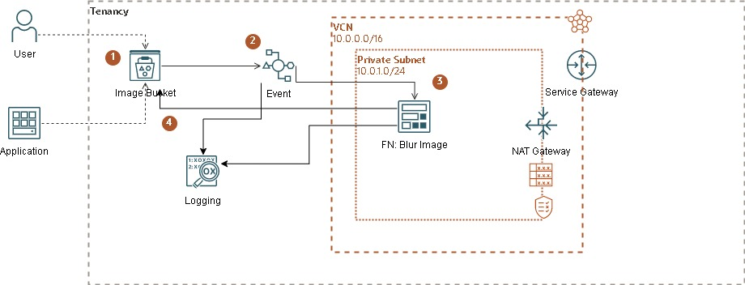
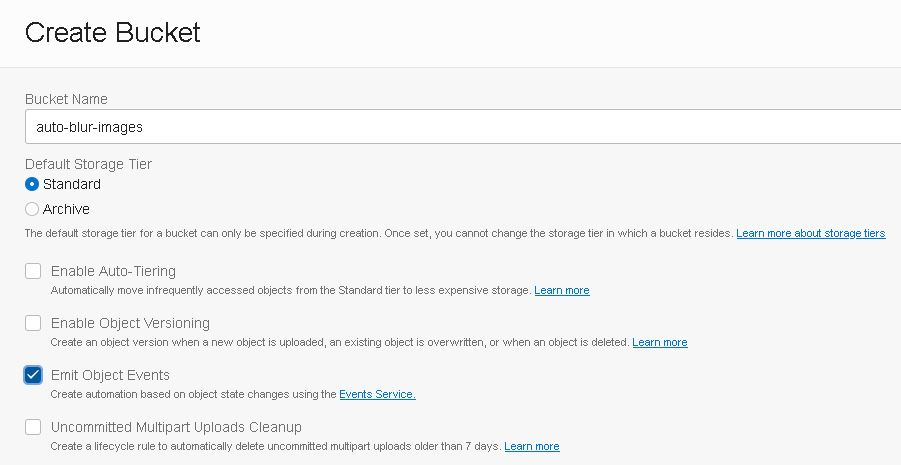
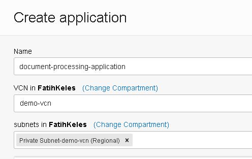

# Auto Blur Images

Let's assume we want to blur faces and license number plates when the images are uploaded to object storage bucket. For this purpose we will use Events service. Object storage is one of the [services that produce events](https://docs.oracle.com/en-us/iaas/Content/Events/Reference/eventsproducers.htm) when a particular event happens. Later with that event we can trigger a function. 

## Prerequsites
1. Create a VCN using [wizard](https://docs.oracle.com/en-us/iaas/Content/Network/Tasks/quickstartnetworking.htm), we will deploy our function into a subnet. 

## Steps
1. [Create Bucket](#1-create-bucket)
2. [Create Application](#1-create-application)
3. [Create Function](#1-create-function)

##  1. Create Bucket
Create a bucket that emits event.


```bash 
oci os bucket create --compartment-id $compartment_id --name auto-blur-images --object-events-enabled true
```

[^ back](#steps)

## 2. Create Application 
Create an application with a private subnet connectivity. 

```bash
oci fn application create --compartment-id $compartment_id --display-name document-processing-application --subnet-ids '["ocid1.subnet.oc1.uk-london-1.aaaaaaaarsfbhp6r6wmgvjrt24344q999999999999999999999999999999"]'
```

[^ back](#steps)

## 3. Create Function
Assuming that you have setup your functions development environment as described [here](https://docs.oracle.com/en-us/iaas/Content/Functions/Tasks/functionsquickstartguidestop.htm), now we create a function following the same [steps](https://docs.oracle.com/en-us/iaas/Content/Functions/Tasks/functionscreatingfirst.htm). 

- Create function with python runtime. This will create a folder named *oss-obj-cre-img-blur-py* which is also the name of the function
```bash
fn init --runtime python oss-obj-cre-img-blur-py
```
- Deploy function under recently created application
```bash
fn --verbose deploy --app  document-processing-application
```

You can clone the clone the repository and edit the code as you like. A few things to mention.

- This function build uses a custom Dockerfile to use OpenCv library. You will notice installation on second stage.
- OpenCv requires package installation and then python bindings.
- You can pass configuration parameters to functions. 
```bash 
fn config function document-processing-application oss-obj-cre-img-blur-py log-level "DEBUG"
```
- Once you have *oci cli* running you can check *test.sh* and *run-demo.sh* scripts to deploy and test the function. 

[^ back](#steps)