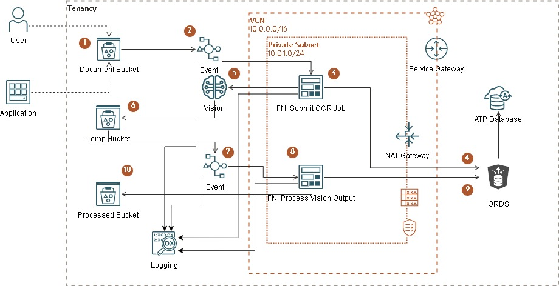
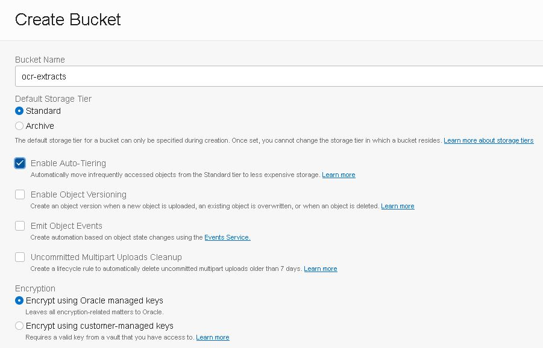
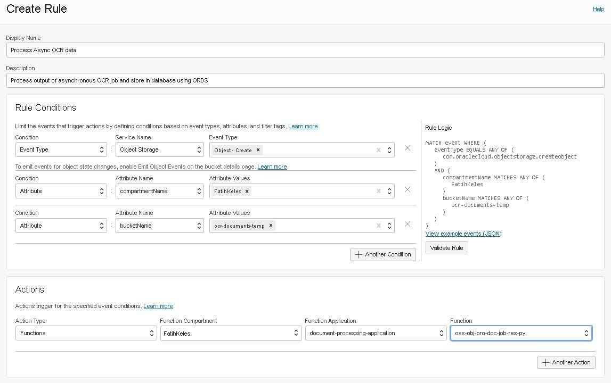
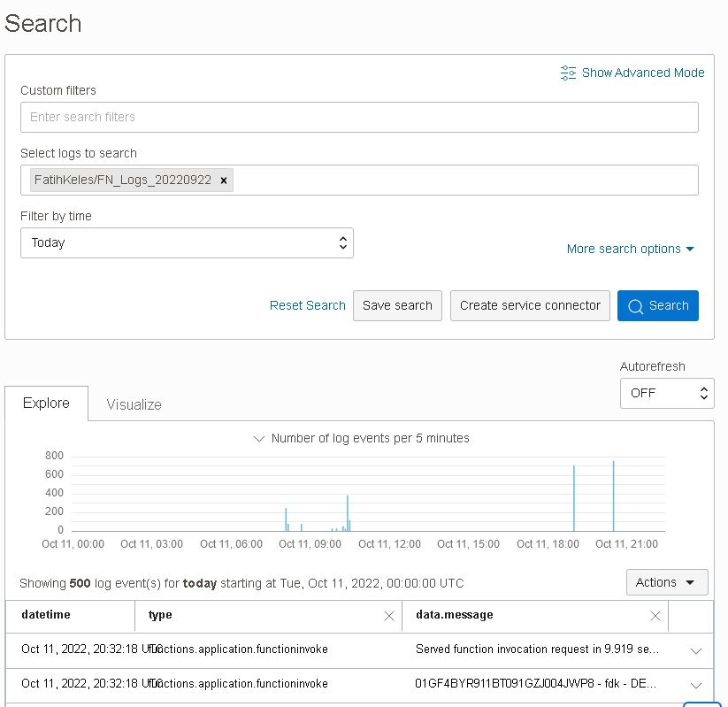
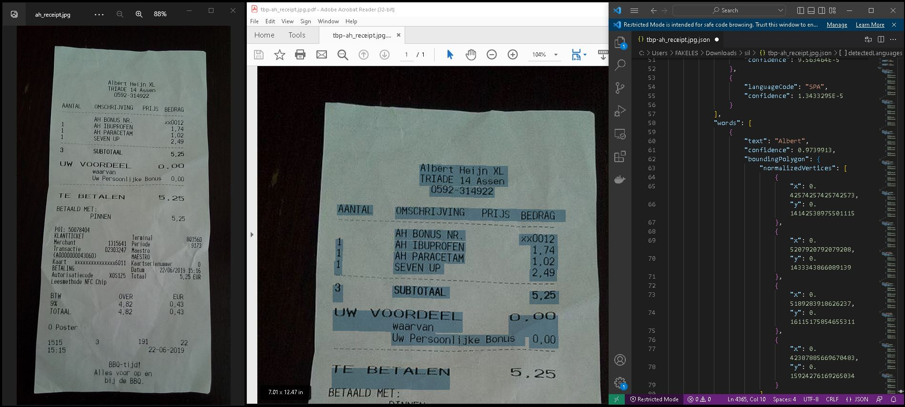

# Part:2 - Process output of Vision document job and organize new information

This is the second part of processing files uploaded to an object storage bucket. Make sure you have completed [Part 1](../oss-obj-cre-doc-job-py/) before working on this part.

**`Steps 5-10`** will take place in part 2 of the implementation.

## Prerequsites
1. Same as [Part 1](../oss-obj-cre-doc-job-py/) 

## Steps
1. [Create Buckets](#1-create-buckets)
2. [Create Function](#2-create-function)
3. [Create Event Rule](#3-create-event-rule)
4. [Enable Logs](#4-enable-logs)
5. [Test what we have done so far](#5-test-what-we-have-done-so-far)
6. [Full text search in database](#6-full-text-search-in-database)


##  1. Create Buckets
Create a bucket that holds the final documents.



```bash 
oci os bucket create --compartment-id $compartment_id --name ocr-extracts 
```

## 2. Create Function
Assuming that you have setup your functions development environment as described [here](https://docs.oracle.com/en-us/iaas/Content/Functions/Tasks/functionsquickstartguidestop.htm), now we create a function following the same [steps](https://docs.oracle.com/en-us/iaas/Content/Functions/Tasks/functionscreatingfirst.htm). 

- Create function with python runtime. This will create a folder named *oss-obj-pro-doc-job-res-py* which is also the name of the function
```bash
fn init --runtime python oss-obj-pro-doc-job-res-py
```
- Deploy function under recently created application
```bash
fn --verbose deploy --app document-processing-application
```

You can clone the repository and edit the code as you like. A few things to mention.

- You can pass configuration parameters to functions. Notice I am passing ORDS URL and object storage bucket name for vision service outputs.
```bash 
fn config function document-processing-application oss-obj-pro-doc-job-res-py ords-base-url "https://gf5f9ffc50769d0-sitl8rh4u9o8ht3x.adb.uk-london-1.oraclecloudapps.com/ords/admin/os_text_extracts/"
fn config function document-processing-application oss-obj-pro-doc-job-res-py log-level "DEBUG"
fn config function document-processing-application oss-obj-pro-doc-job-res-py processed-bucket "ocr-extracts"
fn config function document-processing-application oss-obj-pro-doc-job-res-py ai-vision-output-bucket "ocr-documents-temp"
fn config function document-processing-application oss-obj-pro-doc-job-res-py source-bucket "ocr-documents"
```
- Once you have `oci cli` running you can check `test.sh` and `run-demo.sh` scripts to deploy and test the function using command line.

[^ back](#steps)

## 3. Create Event Rule
Create an event rule to filter object creation with certain attributes. 


Event will match 
```sql
MATCH event WHERE (
    eventType EQUALS ANY OF (
        com.oraclecloud.objectstorage.createobject
    )
    AND (
        compartmentName MATCHES ANY OF (
            FatihKeles
        )
        bucketName MATCHES ANY OF (
            ocr-documents-temp
        )
    )
)
```

If you want to create it with cli
```bash 
## create an actions file input
cat <<EOF > actions.json
{
  "actions": [
    {
      "actionType": "FAAS",
      "description": "Process Vision Output",
      "functionId": "ocid1.fnfunc.oc1.uk-london-1.aaaaaaaadwsre6xl3ametmfvmquxncuxalingf2wb42gjr4tf7tvsh4nmtxq",
      "isEnabled": true
    }
  ]
}
EOF

## pass conditions and actions
oci events rule create --display-name 'Process Async OCR data' --compartment-id $compartment_id --is-enabled true --condition '{"eventType":["com.oraclecloud.objectstorage.createobject"],"data":{"compartmentName":"FatihKeles","bucketName":"ocr-documents-temp"}}' --actions file://actions.json --wait-for-state=ACTIVE
```

[^ back](#steps)

## 4. Enable Logs 
Enabling logs is important for debugging and monitoring during development. I recommend collecting all project logs (event rules, functions etc. ) under same log group, so you can search entire flow.


Once logs are enabled you can monitor and trace the flow.


[^ back](#steps)

## 5. Test what we have done so far 
You can check `test.sh` and `run-demo.sh` scripts for testing and running using command line. Or you can simply upload files into object storage bucket and monitor events using logging service.

As you can see below, once the vision service is done with the receipt image we uploaded, we have a json file listing `coordinates of each word`, line which can be used for `highligting`. And also we have a `searchable pdf` file generated from the image. 


**Tip**: For testing full process go back to [Part 1 - 7. Test what we have done so far](../oss-obj-cre-doc-job-py/README.md#7-test-what-we-have-done-so-far) as it will initiate the workflow. 

[^ back](#steps)

## 6. Full text search in database

**Tip**: For ATP database connection go back to [Part 1 - 6. Create Table and Enable ORDS](../oss-obj-cre-doc-job-py/README.md#6-create-table-and-enable-ords). 

### a. Simple SQL 
Now we can search in our grocery shopping receipt images!
```sql
cl scr
SET LINESIZE 32000
set pages 9999
set lines 200

column resource_Name format a20;
column document_type format a12;
column page_count  format 999;
column mime_type format a12;
column extracted_text format a80;

select resource_Name, document_type, page_count, mime_type, extracted_text
from os_text_extracts
where extracted_text like '%IBUPRO%'
/

RESOURCE_NAME        DOCUMENT_TYP PAGE_COUNT MIME_TYPE    EXTRACTED_TEXT
-------------------- ------------ ---------- ------------ --------------------------------------------------------------------------------
tbp-ah_receipt.jpg   RECEIPT               1 image/jpeg   Albert Heijn XL
                                                          TRIADE 14 Assen
                                                          0592-314922
                                                          AANTAL
                                                          OMSCHRIJVING PRIJS BEDRAG
                                                          AH
```

### b. ORDS Query 
We can simply search over rest api, just append query string `?q={"extracted_text":{"$like":"%IBUPRO%"}}` in your url. 
```bash
curl -g --location 'https://gf5f9ffc50769d0-sitl8rh4u9o8ht3x.adb.uk-london-1.oraclecloudapps.com/ords/admin/os_text_extracts/?q={"extracted_text":{"$like":"%IBUPRO%"}}'  | jq -r '.items[] | "\(.resource_name) \(.document_type) \(.page_count) \(.mime_type)" ' | column -t

  % Total    % Received % Xferd  Average Speed   Time    Time     Time  Current
                                 Dload  Upload   Total   Spent    Left  Speed
100  2901    0  2901    0     0    181      0 --:--:--  0:00:15 --:--:--   739
tbp-ah_receipt.jpg  RECEIPT  1  image/jpeg
```

[^ back](#steps)